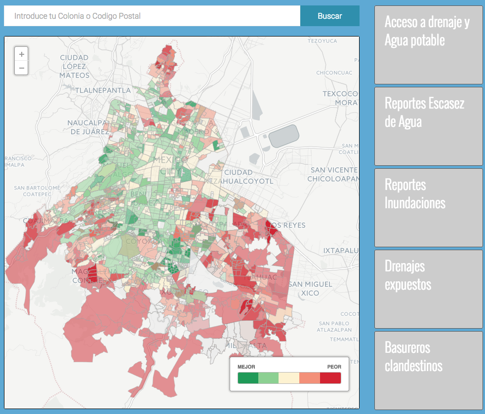
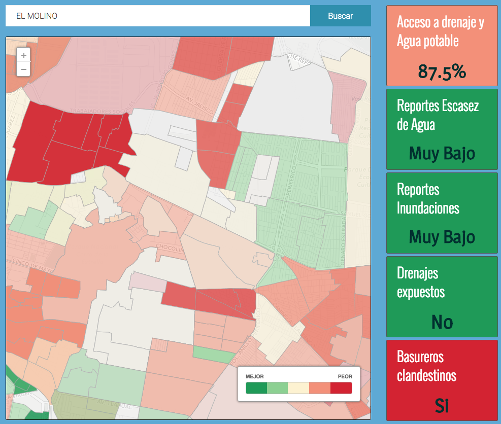
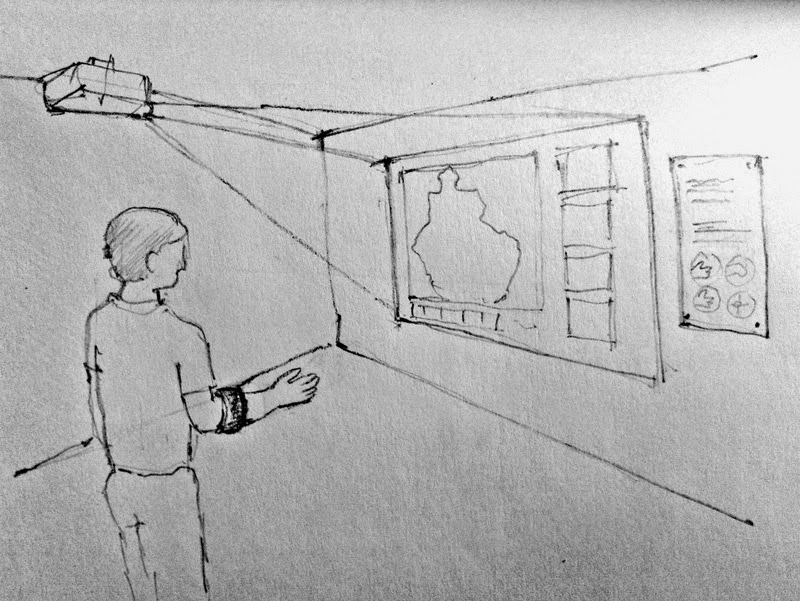
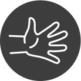

## ¡Aguas Güey! - Experimento Offline

La plataforma online **¡Aguas Güey!** nace para intentar facilitar el aprendizaje sobre los problemas de agua en tu colonia, y motivar a los usuarios a cambiar la situación actual mediante la acción individual y colectiva.

En este experimento *Offline* se pretende llevar a un espacio físico la experiencia de la plataforma *Online*.

### Objetivos

* Transparencia: Facilitar el acceso a la información, concientizar a la gente de cómo están las condiciones de agua en su colonia relativo al resto de la ciudad en términos de cinco indicadores: acceso a agua potable y drenaje, escasez de agua, inundaciones, drenajes expuestos y basureros clandestinos. Esto es importante puesto que dicha información es muy difícil de encontrar y comprender cuando se trata en términos absolutos. La dinámica que hemos construido de ofrecer datos relativos y no absolutos permite a la gente dimensionar de mejor manera la situación del agua en su colonia para poder exigir un mejor servicio.  

* Rendición de cuentas: Al hacer más accesible la información respecto a las condiciones de agua en su colonia, también le damos la capacidad  de exigir un mejor a su gobierno que mejoren las condiciones que más problemas tienen en su colonia. En el espacio de la visualización ofreceremos información de cómo contactar a sus jefes delegacionales y a las autoridades competentes para realizar dichas solicitudes de mejoras. Además, los invitaremos a usar nuestro sitio donde podrán hacer reportes de problemas específicos que podrían enfrentar en sus hogares  y agregar un reporte a nuestra base, donde mediante la acción colectiva generaremos presión social para motivar al gobierno a darle prioridad a colonias con problemas recurrentes.  

* Iniciar a explorar el uso de herramientas lúdicas para hacer la visualización de mapas más divertida e interesante. En particular, nos interesa experimentar con la tecnología que haga más entretenido y atractivo para las personas acercarse e interactuar.

* Mejorar la difusión del sitio online que contiene más funcionalidades como la capacidad de reportar diferentes problemas de agua en la ciudad de manera individual y a su vez de manera colectiva, pues agregaremos todos los resultados por colonia para poner presión a gobierno para actuar en  las colonias con más problemas.  

### Información

La instalación se compone de un espacio, en el que se proyectará sobre una pared un mapa de la Ciudad de Mexico. El usuario podrá interactuar sobre el mapa para visualizar distintos indicadores de riesgo para la salud, relacionados con el agua y los resiudos en la Ciudad de Mexico.

La interfaz será diferente a la del portal Web, pero como ejemplo mostramos aquí una captura del mismo.

El usuario es capaz de navegar el mapa, haciendo zoom y arrastrando, y también puede buscar directamente su colonia. El mapa se centra en su selección.

Al seleccionar una colonia pueden ver un ponderado de distintos factores que afectan a estatus de la colonia con respecto a otras en la misma ciudad. El obejtivo es que también puedan visualizar los indicadores de manera aislada para entender mejor como les afecta, además de otra información de utilidad.

### Datos

Todos los datos usados para la visualización se han obtenido de fuentes publicas:

### Interacción

La interacción del usuario con la instalación se realiza mediante el uso de un controlador que captura los gestos del usuario y los transforma en comandos. Después de investigar otras maneras de interacción nos decidimos por el uso de un controlador [Myo](https://www.thalmic.com/en/myo/). 

Incluimos aquí un par de vídeos sobre esta tecnología:

[Apple Maps Controlled By the Myo (Thalmic Labs)](https://www.youtube.com/watch?v=bhihb6_LsEs)

[Myo - Wearable Gesture Control from @thalmic Labs](https://www.youtube.com/watch?v=oWu9TFJjHaM)

El controlador Myo dispone de un SDK con el cual es muy facil leer los gestos y trasladarlos a comandos en la aplicación.

### Tecnología

[Processing](https://processing.org/): plataforma para el desarrollo de visualizaciones 2D y 3D. Se usa una versión simplificada de Java.

[Unfolding](http://unfoldingmaps.org/): libreria para Processing para visualizar mapas. Es posible usar OpenStreetMaps con esta librería.

[Myo-Processing](https://github.com/nok/myo-processing): libreria para integrar Myo con Processing

### Equipo

Karen Cota - Investigación

Susana Zavala - Investigación 

Gabriel García Plata - Analisis de Datos

David Hernandez - Diseño Información y UX

Oscar Hernandez - Programación

### Presupuesto insumos

* Dos bandas Myo $460 USD ($200 USD de cada una más $60 USD de envío)
* Proyector de 2000 lúmenes, para proyectar en áreas públicas. Estimado de $533 USD ($8,000 MXN)

