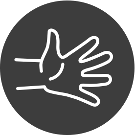

## ¡Aguas Güey! - Experimento Offline

La plataforma online **¡Aguas Güey!** nace para intentar facilitar el aprendizaje sobre los problemas de agua en tu colonia, y motivar a los usuarios a cambiar la situación actual mediante la acción individual y colectiva.

En este experimento *Offline* se pretende llevar a un espacio físico la experiencia de la plataforma *Online*.

### Información

La instalación se compone de un espacio, en el que se proyectará sobre una pared un mapa de la Ciudad de Mexico. El usuario podrá interactuar sobre el mapa para visualizar distintos indicadores de riesgo para la salud, relacionados con el agua y los resiudos en la Ciudad de Mexico.

La interfaz será diferente a la del portal Web, pero como ejemplo mostramos aquí una captura del mismo.

El usuario es capaz de navegar el mapa, haciendo zoom y arrastrando, y también puede buscar directamente su colonia. El mapa se centra en su selección.

Al seleccionar una colonia pueden ver un ponderado de distintos factores que afectan a estatus de la colonia con respecto a otras en la misma ciudad. El obejtivo es que también puedan visualizar los indicadores de manera aislada para entender mejor como les afecta, además de otra información de utilidad.

### Datos

Todos los datos usados para la visualización se han obtenido de fuentes publicas:

### Interacción

La interacción del usuario con la instalación se realiza mediante el uso de un controlador que captura los gestos del usuario y los transforma en comandos. Después de investigar otras maneras de interacción nos decidimos por el uso de un controlador [Myo](https://www.thalmic.com/en/myo/). 

Incluimos aquí un par de vídeos sobre esta tecnología:

[Apple Maps Controlled By the Myo (Thalmic Labs)](https://www.youtube.com/watch?v=bhihb6_LsEs)

[Myo - Wearable Gesture Control from @thalmic Labs](https://www.youtube.com/watch?v=oWu9TFJjHaM)

El controlador Myo dispone de un SDK con el cual es muy facil leer los gestos y trasladarlos a comandos en la aplicación.

### Tecnología

[Processing](https://processing.org/): plataforma para el desarrollo de visualizaciones 2D y 3D. Se usa una versión simplificada de Java.

[Unfolding](http://unfoldingmaps.org/): libreria para Processing para visualizar mapas. Es posible usar OpenStreetMaps con esta librería.

[Myo-Processing](https://github.com/nok/myo-processing): libreria para integrar Myo con Processing

### Equipo

Gabriel García Plata - Analisis de Datos

David Hernandez - Diseño Información y UX

Oscar Hernandez - Programación

Irvin Morales - Cientifico de Datos

### Presupuesto insumos

